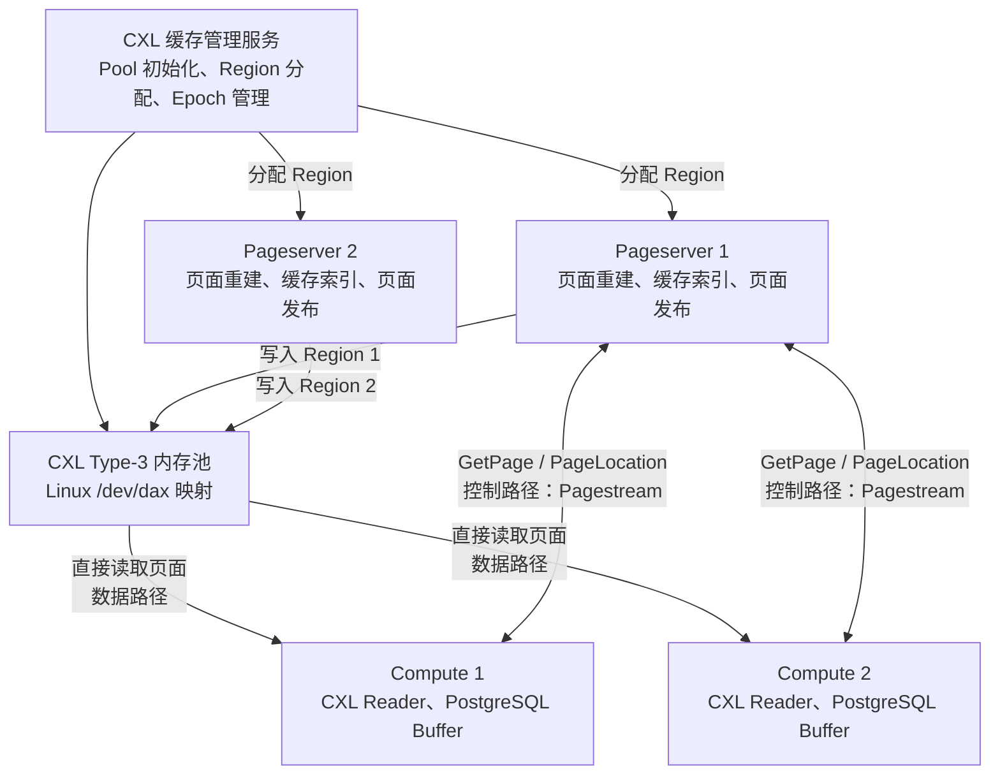
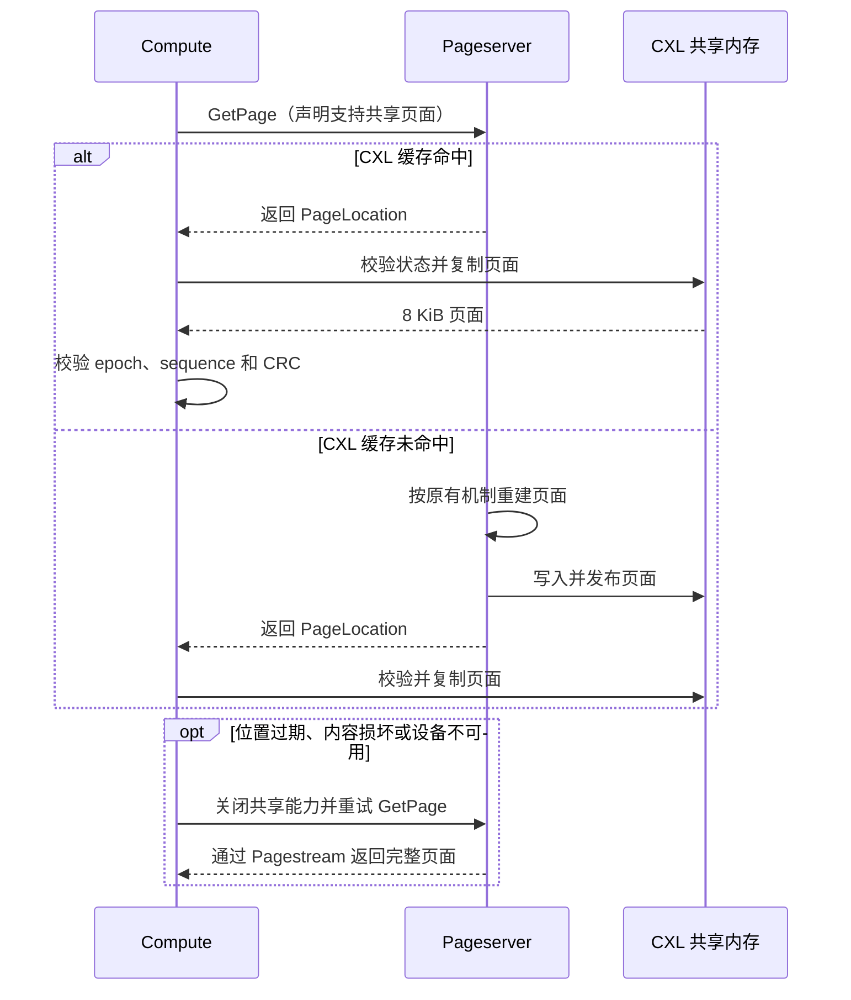

# Neon 基于 CXL 的共享页面缓存设计方案 V3

## 1. 项目背景与问题分析

Neon 采用存算分离架构。Compute 负责运行 PostgreSQL 查询，Pageserver 负责保存页面版本并根据
`PageKey` 和 LSN 重建所需页面。当 Compute 的本地 Buffer Cache 或 Local File Cache 未命中时，
需要通过 Pagestream 向 Pageserver 发起 `GetPage` 请求，由 Pageserver 返回完整的 8 KiB 页面。

这一机制保证了计算节点的弹性和数据一致性，但在数据密集型负载下存在以下开销：

- 每次页面请求都需要经过请求解析、页面重建、响应编码、进程间传输和响应解码；
- 页面数据会在 Pageserver、通信缓冲区和 Compute 之间发生多次复制；
- 多个 Compute 访问相同页面时，各进程分别保存副本，无法共享已重建的页面；
- 随着 Compute 数量和并发度增加，Pagestream 带宽与 Pageserver 发送开销同步增长；
- 热点页面的重复传输会放大尾延迟，并占用本可服务其他请求的 CPU 和通信资源。

单纯扩大 Compute 私有缓存只能提高单个进程的命中率，无法消除跨 Compute 的重复副本，也不能帮助
新启动或缓存较冷的 Compute。增加独立 RPC 缓存服务则仍需经过消息传输和序列化路径，还会引入新的
服务跳数。

CXL（Compute Express Link）Type-3 内存设备能够为同一主机上的多个进程提供统一、可直接寻址的
内存窗口。基于这一能力，本方案在 Pageserver 和 Compute 之间建立共享页面缓存：Pageserver 将已
生成的页面发布到 CXL 内存，Compute 通过页面位置直接读取，Pagestream 仅传递控制信息。由此将页面
数据路径从“进程间传输”转变为“共享内存读取”，同时保留 Neon 原有路径作为可靠回退。

## 2. 建设目标与设计原则

### 2.1 建设目标

本方案面向单台 Linux 主机内多 Pageserver、多 Compute 的 Neon 部署，建设目标如下：

1. 减少完整 8 KiB 页面经 Pagestream 传输的次数，降低页面传输带宽和复制开销；
2. 缩短 `GetPage` 数据路径，改善页面读取的平均延迟和尾延迟；
3. 允许多个 Compute 共享 Pageserver 已发布的页面，减少重复缓存和重复传输；
4. 支持多 Pageserver 对共享内存进行独立、安全的资源管理；
5. 在 CXL 不可用或页面校验失败时透明回退，保证数据库正确性与可用性不受影响；
6. 保持上层缓存协议与底层介质解耦，为原型验证和真实 CXL 设备部署提供一致的逻辑模型。

### 2.2 设计原则

- **不改变持久化边界**：CXL 只保存可丢失、可重建的页面副本，不替代 WAL、Pageserver Layer
  或对象存储，不参与数据库恢复。
- **单写多读**：Pageserver 是共享页面的生成者和发布者；Compute 只读，并将页面复制到
  PostgreSQL Buffer 后再参与查询处理。
- **控制与数据分离**：页面请求、能力协商和页面位置仍通过 Pagestream 传递，页面内容从 CXL
  内存直接读取。
- **逻辑地址跨进程传递**：进程间只传递 Region、Slot、偏移和版本等逻辑位置，不传递仅在单个
  进程地址空间中有效的裸指针。
- **正确性优先于命中率**：任何状态不确定、位置过期或内容损坏都按未命中处理，立即回退到原始
  Pagestream 页面返回路径。
- **渐进兼容**：未启用 CXL 的 Compute 和 Pageserver 保持原有行为，新旧节点可通过协议能力进行
  协商。

### 2.3 非目标

本阶段不使用 CXL 页面替代 PostgreSQL Buffer，不把共享缓存作为持久化介质，也不解决跨物理主机的
CXL Fabric 管理、在线容量重分配及不可信租户之间的硬件级安全隔离。上述能力属于后续生产化范围，
不影响本方案在单机可信部署边界内的验证。

## 3. 方案选型与总体架构

### 3.1 方案比较

| 方案 | 数据路径 | 跨 Compute 共享 | 主要优点 | 主要局限 |
|---|---|---:|---|---|
| 扩大进程私有缓存 | Compute 本地内存 | 否 | 改造较小，访问延迟低 | 重复副本多，冷启动仍需远程取页 |
| 独立 RPC 页面缓存 | RPC 请求与页面响应 | 是 | 部署边界清晰，可集中管理 | 仍有序列化、网络栈和额外服务跳数 |
| CXL 共享页面缓存 | 控制信息走 Pagestream，页面走共享内存 | 是 | 避免完整页面传输，适合多进程共享 | 依赖同机 CXL 能力，需要并发校验与回退机制 |

综合 Neon 单机多进程部署形态和页面读多写少的特征，本方案选择 CXL 共享页面缓存。它不取代现有
缓存层，而是在 Pageserver 与 Compute 之间增加一条可选的快速数据路径。

### 3.2 总体架构



CXL 缓存管理服务负责初始化共享内存池、维护池身份和生命周期，并为 Pageserver 分配互不重叠的
Region。它不参与页面级读写，也不维护页面索引。每个 Pageserver 独立管理自己的 Region，完成页面
索引、Slot 分配、发布和淘汰。Compute 映射同一 CXL 设备，根据 Pageserver 返回的逻辑位置读取页面，
校验成功后复制到 PostgreSQL Buffer。

目标部署使用 Linux DAX（Direct Access）接口将 CXL Type-3 设备以内存映射方式暴露为
`/dev/dax`。缓存层面向统一的共享内存抽象，因而底层介质变化不会改变 Region、Slot、页面位置以及
读写校验规则。

## 4. 核心设计

### 4.1 共享内存组织

共享池由池级控制区和若干 Region 组成。Region 是 Pageserver 的资源隔离和生命周期管理单元，每个
Region 在任一时刻只归属于一个 Pageserver。Region 内部划分为固定大小的 Slot，一个 Slot 保存一份
完整页面及其必要的状态信息。

页面位置由池身份、Region 标识、Region epoch、Slot 标识、Slot sequence、数据偏移和校验信息共同
描述。该位置不等同于虚拟地址：Pageserver 和 Compute 可以把 CXL 设备映射到不同地址，并分别使用
本地映射基址与逻辑偏移计算访问地址。

Pageserver 重启或重新取得 Region 时递增 Region epoch，使重启前发出的所有页面位置整体失效；
Slot 每次被重新写入时递增 sequence，使淘汰或覆盖前发出的旧位置失效。

### 4.2 关键组件设计

#### CacheKey

Pageserver 使用 CacheKey 唯一标识一个可复用的页面版本：

```text
CacheKey = {
    tenant_shard_id,
    timeline_id,
    relation_id,
    block_number,
    effective_lsn
}
```

其中，Tenant Shard 和 Timeline 用于隔离不同租户分片及分支；Relation 和 Block Number 定位
PostgreSQL 关系中的具体页面；`effective_lsn` 表示 Pageserver 实际重建出的页面版本。同一逻辑页面
在不同 LSN 下可能具有不同内容，因此 LSN 必须进入 CacheKey。

CacheKey 使用 Pageserver 解析后的 `effective_lsn`，而不是 Compute 请求中携带的原始 LSN。多个
请求 LSN 可能对应同一个有效页面版本，使用 `effective_lsn` 可以在保证版本正确的同时提高复用率。
完整 CacheKey 只保存在 Pageserver 的进程内索引中，CXL Slot 仅保存其哈希，用于诊断和辅助一致性
检查，不依赖哈希恢复索引或判断页面身份。

#### CXL Cache Manager

CXL Cache Manager 位于 Pageserver 内部，是页面缓存的核心管理组件，主要负责：

- 维护 `CacheKey → PageLocation` 的正向索引和 `Slot → CacheKey` 的反向索引；
- 管理当前 Pageserver 所属 Region 中的 Slot；
- 处理缓存查询、页面发布、位置校验和失效索引清理；
- 空间不足时选择可淘汰 Slot，并在覆盖前删除对应的旧索引。

第一阶段采用 CLOCK 淘汰策略。新页面优先使用未分配 Slot；空间耗尽后，扫描器为近期访问过的页面
保留一次机会，并选择未被再次访问的页面作为淘汰对象。该策略实现和内存开销较低，同时能够避免
简单轮转对热点页面造成频繁淘汰。

#### CXL 缓存管理服务

CXL 缓存管理服务负责共享内存池的资源控制面。它初始化并独占管理 CXL Pool，为 Pageserver 分配
互不重叠的 Region，记录 Region 所有者，并在重新分配时更新 Region epoch。

该服务不维护 CacheKey、页面索引或淘汰状态，也不参与 GetPage 的页面读写过程。页面级管理下沉到
各 Pageserver，可以避免集中式服务进入高频数据路径，并保持不同 Pageserver 之间的管理隔离。

#### PageLocation

Pageserver 通过 PageLocation 向 Compute 描述共享页面的位置及其有效性条件：

```text
PageLocation = {
    pool_identity,
    pool_epoch,
    region_id,
    region_epoch,
    slot_id,
    slot_sequence,
    data_offset,
    page_length,
    checksum
}
```

Pool 身份和 epoch 用于确认双方访问的是同一代共享内存池；Region ID 和 epoch 防止 Region 被回收
或重新分配后继续使用旧引用；Slot ID 和 sequence 防止页面淘汰覆盖后误读新内容；数据偏移和长度
用于定位页面并执行边界检查；checksum 用于验证页面完整性。

PageLocation 是短生命周期的逻辑引用，不是跨进程裸指针或持久化地址。Compute 每次读取都必须重新
验证其有效性，不能因为此前读取成功而假设该位置继续有效。

#### 页面发布器与 Compute CXL Reader

页面发布器由 Pageserver 在页面重建或缓存填充时调用。它先选择 Slot 并将其置为不可读的写入状态，
再写入完整页面和校验信息，最后通过原子发布使新 sequence 对 Reader 可见。只有发布完成后，
Pageserver 才返回对应的 PageLocation。

Compute CXL Reader 收到 PageLocation 后，依次校验 Pool、Region、Slot、偏移和发布状态，记录
sequence 并将页面复制到私有缓冲区。复制完成后再次检查 sequence，确认页面在读取期间未被覆盖，
随后执行 CRC 校验。全部通过后，页面才能进入 PostgreSQL Buffer。

页面发布失败时，Pageserver 直接返回普通 Pagestream 页面；Reader 映射失败、位置失效或内容校验
失败时，Compute 放弃共享副本并通过普通 Pagestream 重试。两种组件共同构成可选加速路径，不改变
Neon 原有 GetPage 的正确性边界。

| 组件 | 所在进程 | 核心职责 | 不承担的职责 |
|---|---|---|---|
| CXL 缓存管理服务 | 独立 daemon | Pool 初始化、Region 分配和 epoch 管理 | 页面索引与 GetPage 数据传输 |
| CXL Cache Manager | Pageserver | CacheKey 索引、Slot 管理和淘汰 | 数据持久化 |
| 页面发布器 | Pageserver | 页面写入、校验信息生成和原子发布 | Compute 侧页面使用 |
| Compute CXL Reader | Compute | 位置校验、页面复制、CRC 校验和回退 | 修改或长期持有共享页面 |

### 4.3 页面发布与读取

Pageserver 以租户、时间线、页面键和 LSN 共同标识一个缓存页面。当页面已经位于 CXL 缓存时，
Pageserver 返回其位置；未命中时，Pageserver 按 Neon 原有机制重建页面，再选择可用 Slot 完成写入
和发布。

发布过程遵循“先写数据、后发布状态”的顺序。Compute 只有在 Slot 已处于可读状态时才复制页面。
读取前后均检查 sequence：若两次检查结果不同，说明页面在复制过程中被覆盖，当前内容必须丢弃。
随后 Compute 校验 CRC，成功后才把 8 KiB 页面交给 PostgreSQL Buffer。

Compute 不长期持有 CXL 页面地址，也不直接修改共享页面。这样既保持 PostgreSQL Buffer 作为查询
执行工作副本的语义，也缩短共享 Slot 被读取操作占用的时间。

### 4.4 正常、未命中与回退流程



### 4.5 一致性与故障处理

本方案不依赖 CXL 缓存保存唯一数据，因此一致性目标不是恢复缓存内容，而是确保 Compute 只接受
能够证明有效的页面：

- **池与 Region 校验**：池身份或 Region epoch 不一致时，拒绝旧位置；
- **发布状态校验**：未完成发布或正在被改写的 Slot 不可读取；
- **覆盖检测**：复制前后的 sequence 必须一致，避免读取到混合页面；
- **内容校验**：CRC 不一致时认为页面损坏；
- **边界校验**：Region、Slot、偏移和长度必须位于已分配范围内；
- **失败回退**：设备打开、映射或上述任一校验失败时，Compute 通过普通 Pagestream 重新请求页面。

缓存管理服务或 Pageserver 重启不会导致数据库数据丢失。相关 Region 可直接视为冷缓存，新的 epoch
会使遗留位置失效。CXL 设备不可用时，系统性能可能下降，但查询正确性和基础服务能力仍由 Neon 原有
取页路径保障。

### 4.6 兼容、隔离与淘汰

Compute 仅在本地已启用 CXL、设备映射成功且协议版本支持时，才在 `GetPage` 中声明共享页面能力。
Pageserver 只有同时具备共享缓存并收到该能力标志时才返回页面位置，否则继续返回完整页面。该机制
允许功能按节点逐步启用，并避免不支持 CXL 的 Compute 收到无法处理的响应。

不同 Pageserver 使用互不重叠的 Region，不能写入其他 Pageserver 的空间。Region 内空间耗尽时，
Pageserver 根据淘汰策略选择 Slot 重新发布；旧引用因 sequence 变化而被 Compute 拒绝。生产化阶段
可在不改变读取协议的前提下进一步引入热点感知、访问频率统计和 Region 配额调整。

## 5. 方案价值、风险与演进

### 5.1 预期价值

- **降低传输量**：CXL 命中时 Pagestream 只传递页面位置，避免返回完整 8 KiB 页面；
- **缩短取页路径**：Compute 从共享内存复制页面，减少响应编码、通信栈和解码环节；
- **减轻 Pageserver 开销**：同一已发布页面可被多个 Compute 读取，减少重复发送和中间缓冲；
- **提高共享效率**：共享池保留一份页面即可服务多个 Compute，尤其有利于相同数据集上的弹性扩容
  和冷节点预热；
- **保持可用性**：CXL 是可选加速层，故障时自动回到原有路径，不改变数据安全边界。

实际收益取决于 CXL 访问延迟、工作集大小、共享命中率和负载并发度，必须通过与 Baseline 的同条件
实验得出，不在设计阶段预设性能提升比例。

### 5.2 主要风险与应对

| 风险 | 影响 | 应对措施 |
|---|---|---|
| CXL 访问延迟或 CRC 成本抵消收益 | 低命中负载下加速不明显 | 分阶段计时，评估复制与校验成本，按负载决定是否启用 |
| 热点 Slot 或索引竞争 | 并发扩展受限 | Region 内分片、降低共享写锁粒度，并评估无锁读取 |
| 设备、映射或缓存内容异常 | 页面读取失败 | 全量边界与版本校验，失败后自动回退 Pagestream |
| Region 利用率不均 | 部分 Pageserver 空间不足 | 先采用静态配额保证隔离，后续引入监控和受控再分配 |
| 新旧协议能力不一致 | 节点升级期间请求失败 | 显式能力协商，默认使用兼容的普通页面响应 |
| CXL 故障被误认为数据故障 | 运维定位困难 | 分类型记录命中、过期、校验和映射失败指标 |

### 5.3 实施演进路线

1. **原型验证阶段**：使用普通共享文件和 `mmap(MAP_SHARED)` 模拟多进程可见的 CXL 内存窗口，
   验证页面发布、直接读取、协议协商、一致性校验和自动回退。
2. **真实 CXL 接入阶段**：在具备 CXL Type-3 设备的 Linux 环境中接入 `/dev/dax`，保持上层内存
   布局和协议语义不变，验证设备映射、访问权限、NUMA 拓扑和异常恢复。
3. **性能与生产化阶段**：完善淘汰策略、动态配额、监控告警、安全治理和灰度开关，并依据基准结果
   优化 CRC、复制方式和并发数据结构。

当前仓库中的文件映射原型已经打通 Pageserver 发布、Compute 读取、Pagestream 能力协商、页面完整性
校验和失败回退链路，并完成单 Pageserver 端到端读取及双 Pageserver Region 隔离等功能验证。该结果
证明了总体数据路径的可行性，但不等同于真实 CXL 环境下的性能结论；DAX 接入、硬件测试和生产化
治理仍属于后续工作。

## 6. 验证方案与验收标准

### 6.1 功能与故障验证

| 类别 | 验证场景 | 预期结果 |
|---|---|---|
| 端到端读取 | Pageserver 发布页面，Compute 经 CXL 读取 | 查询结果正确，CXL 命中和读取字节指标增长 |
| 多进程共享 | 多个 Compute 读取相同页面 | 均可读取同一共享副本，无需分别由 Pagestream 传页 |
| Region 隔离 | 多 Pageserver 同时申请和使用空间 | Region 不重叠，各自只能管理所属区域 |
| 缓存覆盖 | Slot 被淘汰并写入新页面 | 旧 sequence 被拒绝，新页面可正常读取 |
| 服务重启 | Pageserver 或缓存管理服务重启 | 旧 epoch 失效，数据库查询可继续并重新预热缓存 |
| 协议兼容 | CXL 开关关闭或旧协议 Compute 访问 | Pageserver 返回普通页面，原有流程不受影响 |
| 内容损坏 | 注入错误 CRC 或修改页面内容 | 校验失败并自动回退，最终查询结果正确 |
| 设备异常 | 设备不可访问、映射失败或越界位置 | 不使用可疑页面，自动通过 Pagestream 重新取页 |

### 6.2 性能验证

性能实验使用同一构建产物、相同数据集、SQL、并发度、运行时间和随机种子，仅切换共享缓存能力，
分别形成 Baseline 与 CXL 两组结果。每组应进行预热和不少于三轮交叉测试，以中位数降低偶然抖动。

主要评价指标包括：

- TPS、平均延迟以及 P95/P99 延迟；
- Compute 的 `GetPage` 平均等待时间和请求耗时；
- CXL 读取、页面复制和 CRC 校验耗时；
- CXL 命中率、回退率及各类回退原因；
- Pagestream 返回的完整页面数量和对应字节量；
- Compute、Pageserver 与缓存管理服务的 CPU 使用率；
- 多 Compute 并发下的吞吐扩展性和共享内存占用。

Baseline 应采用同一套 CXL 代码构建但关闭共享页面能力的工程 A/B 口径；如需评价相对上游 Neon 的
整体收益，应另行使用改造前后二进制进行独立对照，避免混淆两种实验结论。

### 6.3 阶段性验收标准

本阶段不以未经实测的固定性能增幅作为验收门槛。方案满足以下条件即可完成阶段性验收：

1. 普通路径与 CXL 路径返回的页面和 SQL 结果一致，数据库正确性无退化；
2. CXL 页面位置过期、内容损坏或设备不可用时能够自动回退，业务查询不中断；
3. 监控指标能够证明页面确实经共享内存读取，并能区分命中、回退及失败原因；
4. 多 Pageserver 的 Region 隔离、缓存覆盖和重启失效机制符合设计；
5. 在真实 CXL/DAX 环境中形成可复现的 Baseline/CXL 对比报告，说明适用负载、性能收益和资源成本；
6. 未启用 CXL 的节点保持协议兼容，无需改变 Neon 原有持久化和恢复机制。

## 7. 总结

本方案利用 CXL Type-3 内存的跨进程共享能力，在 Neon Pageserver 与 Compute 之间增加共享页面
缓存。Pagestream 继续承担请求和页面位置传递，完整页面则由 Compute 从 CXL 内存直接读取，从而
减少重复传输和进程私有副本。

方案将 CXL 明确定位为可丢失的性能加速层，通过 epoch、sequence、发布状态和 CRC 建立完整的页面
有效性判断，并以原始 Pagestream 路径作为统一回退。这一设计不改变 Neon 的数据持久化、恢复和
PostgreSQL Buffer 语义，可在保持正确性和兼容性的前提下逐步验证并引入真实 CXL 能力。
